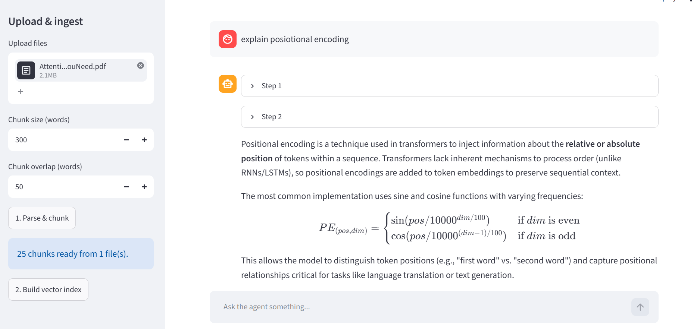

# react-mcp-agent-template

A domain-agnostic ReAct agent template: a Skill Router picks relevant Skills for the current
question, a Dynamic Prompt Builder assembles a system prompt from those Skills plus only the MCP
tool schemas they reference, and a provider-agnostic ReAct loop drives Thought/Action/Observation
cycles against real MCP tools. A local Streamlit UI adds file upload, vector/graph RAG over your
own documents, and a live trace view for testing.

## Architecture




## Providers: Groq by default, or fully offline with Ollama

The committed default is `provider: groq` in `config.yaml` — hosted inference, fast, needs a free
`GROQ_API_KEY` in `.env` (get one at https://console.groq.com/keys). `run.py`/the UI only ever
build a provider for whichever one is selected, so `GroqProvider` is simply never instantiated
if you switch away from it.

**Prefer zero API keys and nothing leaving your machine?** Set `provider: ollama` in
`config.yaml` instead. Generation then goes through your local Ollama server and makes no external
network calls for that part of the pipeline. Nothing here requires a GPU.

**One nuance either way:** embeddings for RAG always go through Ollama, regardless of which
generation provider is active — Groq is generation-only and is never used for embeddings or for
building the vector/graph index. So even with `provider: groq`, you still need a reachable Ollama
host (see `OLLAMA_HOST` in `.env`) for the RAG features specifically; only the ReAct loop's
generation calls go to Groq.

## Quickstart

```bash
python -m venv .venv
source .venv/Scripts/activate   # Windows Git Bash; use .venv\Scripts\activate on cmd/PowerShell
pip install -r requirements.txt
cp .env.example .env            # add your GROQ_API_KEY (https://console.groq.com/keys)
ollama pull nomic-embed-text    # embeddings always run through Ollama, even with provider: groq

python run.py "What's 12 plus 30, and what time is it?"
```

Prefer fully offline, zero API keys? Set `provider: ollama` in `config.yaml`, then also:

```bash
ollama pull qwen3:4b            # or any model you like — first non-embedding `ollama list` entry
                                 # is used by default if ollama.model is left null
```

Conda works just as well as venv:

```bash
conda create -n react-mcp-agent python=3.10
conda activate react-mcp-agent
pip install -r requirements.txt
```

To use the UI:

```bash
streamlit run ui/app.py
```

See "Using the UI" below for a walkthrough of what to click once it's open.

## Configuration

Everything lives in `config.yaml` (non-secret settings) and `.env` (secrets — `OLLAMA_HOST`,
optional `GROQ_API_KEY`). `.env` is gitignored; only `.env.example` is committed.

Key `config.yaml` fields:

- `provider` — `groq` (committed default, needs `GROQ_API_KEY`) or `ollama` (fully offline, zero
  API keys).
- `ollama.model` / `groq.model` — leave `ollama.model: null` to auto-pick the first
  non-embedding model from `ollama list` on `OLLAMA_HOST`. **Caveat:** if `OLLAMA_HOST` is a
  shared host that also serves non-chat specialist models (OCR, vision-only, etc.), auto-pick
  can't tell those apart from a general chat model and may grab the wrong one — pin `ollama.model`
  explicitly in that case.
- `embedding.model` — the Ollama model used for RAG embeddings (default `nomic-embed-text`).
- `max_steps` — hard cap on ReAct steps per turn.
- `mcp.servers` — list of `{name, command}` MCP stdio servers the agent connects to every turn.
- `skills.directory` / `skills.max_active_skills` — where Skills live and how many can be active
  per turn.
- `rag.*` — chunking, vector/graph store paths, `max_file_size_mb`, and `graph_chunk_cap` (see
  below).

## Traces

Every `run.py` call or UI turn writes the full Thought/Action/Observation sequence to
`traces/<timestamp>.json` — see `examples/trace_example.md`. This is the basis for comparing
models/providers on the same task: run the same question under `provider: ollama` and
`provider: groq`, diff the `steps`, and look at step count, tool choices, and whether the parser
had to fall back (non-null `error` field) on either run.

## RAG: vector vs. graph

The UI (`ui/app.py`) can ingest CSV/XLSX/PDF/TXT/MD/DOC/DOCX files (up to `rag.max_file_size_mb`,
default 50MB) and build either:

- **Vector index** (`rag.mode: vector`) — chunks are embedded with the selected Ollama embedding
  model and stored in a local, disk-backed Chroma collection. One embedding call per chunk.
- **Graph index** (`rag.mode: graph`) — each chunk is sent to the *active generation LLM*
  (whichever provider/model you have selected — no separate NER dependency) to extract
  `{subject, relation, object}` triples, which build an in-memory `networkx` graph pickled to
  disk. One full LLM call per chunk, which is much slower and costs more tokens than embedding.

Because graph mode is one LLM call per chunk, the UI shows the estimated chunk count and a
configurable safety cap (`rag.graph_chunk_cap`, default 200) before building: exceeding the cap
blocks the build with an explicit message telling you to raise the cap yourself, and even under
the cap you must explicitly check a confirmation box before the build button is available.

Ingestion registers `query_documents` (vector) or `query_graph` (graph) as MCP tools via
`tools/rag_server.py`, and `skills/rag_skill.md` is the matching Skill that teaches the router when
to call them.

## Using the UI

```bash
streamlit run ui/app.py
```

opens `http://localhost:8501` in your browser. In the sidebar:

1. Pick a **generation provider** (`ollama`/`groq`) and **model** — the model dropdown is
   populated live from `ollama list` on `OLLAMA_HOST`.
2. Pick an **embedding model** (e.g. `nomic-embed-text`) and a **RAG mode** (`vector` or `graph`).
3. **Upload** a csv/xlsx/pdf/txt/md/doc/docx file (`rag.max_file_size_mb` cap).
4. Click **"1. Parse & chunk"** — shows the resulting chunk count.
5. Vector mode: click **"2. Build vector index"**. Graph mode: tick the LLM-call-count
   confirmation checkbox, then click **"2. Build graph index"** (blocked above
   `rag.graph_chunk_cap` until you raise it).

Then just chat in the main panel — each Thought/Action/Observation step streams into an
expandable panel live as the agent works, not just the final answer.

Note: the UI reconnects to MCP servers and reloads Skills fresh on every turn — correct, but
expect a couple seconds of "Thinking..." before the first step appears.

## Troubleshooting

- **`ModuleNotFoundError` for a dependency you know you installed** — you're very likely running
  a different Python than the one you installed `requirements.txt` into (e.g. conda's base env
  instead of your project env). Check `where python` / `which python` and confirm the path
  contains your venv/conda env name before re-running.
- **Slow/remote `OLLAMA_HOST` times out on connect** — this project sets a generous
  `httpx.Timeout(120.0, connect=30.0)` on every Ollama client for exactly this reason (the
  library's own default is a flat 5s, too tight for anything beyond `localhost`). If you're
  still seeing `ConnectTimeout`s, the host itself is the bottleneck, not this project.

## Project structure

```
agent/            provider-agnostic ReAct loop, prompt builder, skill router, MCP client, parser
agent/providers/  Provider interface + Ollama and Groq implementations
skills/           Markdown + YAML-frontmatter Skills (trigger keywords -> tools -> instructions)
tools/            MCP stdio servers (example dummy tools, RAG query tools)
ui/               Streamlit app + ingestion/chunking/embedding + Chroma/graph store wrappers
data/             gitignored — uploaded files and built indexes live here
traces/           gitignored — one JSON file per agent run
tests/            pytest suite (parser, both providers with mocked/fake clients)
examples/         sample trace walkthrough
```

## Customizing this template

The `agent/` package is domain-agnostic. To adapt this template to a new task you should only
need to:

1. Write a new MCP server under `tools/` exposing whatever tools your domain needs.
2. Add a Skill file under `skills/` with trigger keywords and the tool names it should expose.
3. Add the new server to `mcp.servers` in `config.yaml`.
4. Upload domain data through the UI (or point `rag.vector_store_dir` at a pre-built index).
5. Adjust `config.yaml` / `.env` for provider, model, and RAG settings.

Nothing in `agent/core.py`, `agent/prompt_builder.py`, or `agent/skill_router.py` should need to
change.

## Testing

```bash
pytest
```

`tests/test_parser.py` covers the ReAct output parser, including its fail-soft behavior on
malformed model output. `tests/test_providers.py` verifies both `OllamaProvider` and
`GroqProvider` implement the shared `Provider` interface correctly, using fake clients — no live
Ollama server or Groq API key is required to run the suite.

## Design notes worth knowing before you extend this

**Keyword vs. embedding skill matching.** `KeywordRouter` does case-insensitive substring matching
against explicit trigger phrases — zero dependencies, fully deterministic, and easy to debug (you
can always see *why* a skill matched). The cost is that it doesn't generalize: a synonym you
didn't list as a trigger won't match. `BaseSkillRouter` exists specifically so an `EmbeddingRouter`
(matching by semantic similarity instead of substrings) can be dropped in later without touching
`agent/core.py` — it only ever calls `.route(user_input)`.

**Why tool filtering is skill-driven.** Dumping every MCP tool's schema into every prompt burns
context and gives smaller/local models more chances to pick the wrong tool. Gating tool exposure
behind matched Skills keeps the prompt small and the tool choice constrained to what's actually
relevant — at the cost of an occasional false negative, which is why unmatched turns fall back to
exposing every tool rather than stranding the agent.

**Why traces matter.** Local models vary a lot in how reliably they follow the ReAct format and
how many steps they need. Writing the full Thought/Action/Observation sequence to disk every run
is what makes "is model A better than model B for this Skill" an answerable, diffable question
instead of a vibe.

**Why the parser fails soft.** A malformed `Action Input:` or a missing `Final Answer:` from a
smaller local model shouldn't crash the run — `parse_react_step` always returns a `ReActStep`,
populating `.error` instead of raising. The agent loop turns that error into a corrective
Observation ("reformat your response using...") and lets the model try again, which is far more
robust against weaker models than hard-failing on the first bad output.

**Vector vs. graph RAG on limited hardware.** Vector search is one cheap embedding call per chunk
and is the right default for "find the relevant passage" questions. Graph extraction is one full
LLM call per chunk and is much slower and more expensive — but it's the only one of the two that
can actually answer "how is X related to Y" questions that span multiple chunks. On a mid-spec
machine, default to vector mode; only reach for graph mode on smaller document sets where you
specifically need multi-hop relationship queries, and respect `graph_chunk_cap`.

**Skill names aren't tools — say so explicitly.** A weaker model can conflate a matched Skill's
*name* (shown in the "Active Skills" section) with a callable tool, especially when they sound
related, and hallucinate an Action that doesn't exist. `base_prompt.txt` states this rule
explicitly, plus a rule against parroting an error Observation back as the Final Answer instead of
using data already gathered — both were added after observing exactly this failure on a smaller
model mid-task. Weaker models benefit from more explicit prompts; don't assume rules that are
"obvious" from the tool schema alone will be followed.

**When to reach for Groq vs. staying local.** Ollama is free, private, and has no rate limits, but
a mid-spec machine's local models are slower and weaker than hosted ones — expect more ReAct
parser fallbacks and more steps to reach a Final Answer, especially on smaller models, and a local
or LAN Ollama host can simply be unreachable sometimes (network/VPN issues, host down), which is
exactly the failure mode that made `groq` the more reliable committed default here. Switch to
`provider: ollama` for anything privacy-sensitive, for genuinely zero-API-key offline use, or when
you'd rather not depend on an external host's uptime at all.
